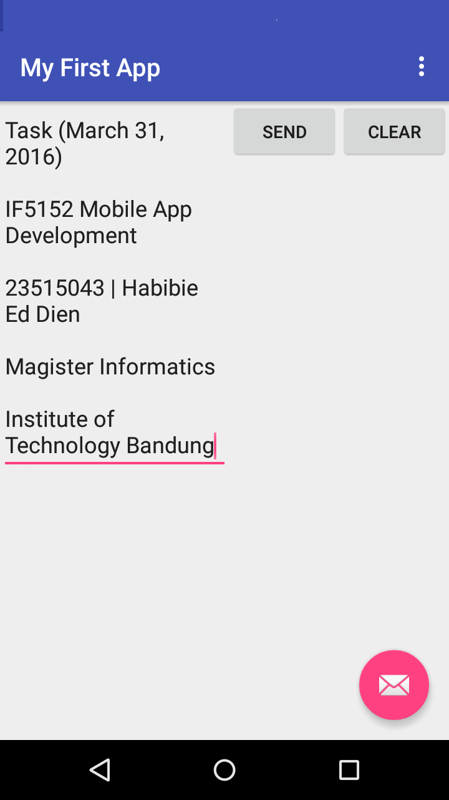
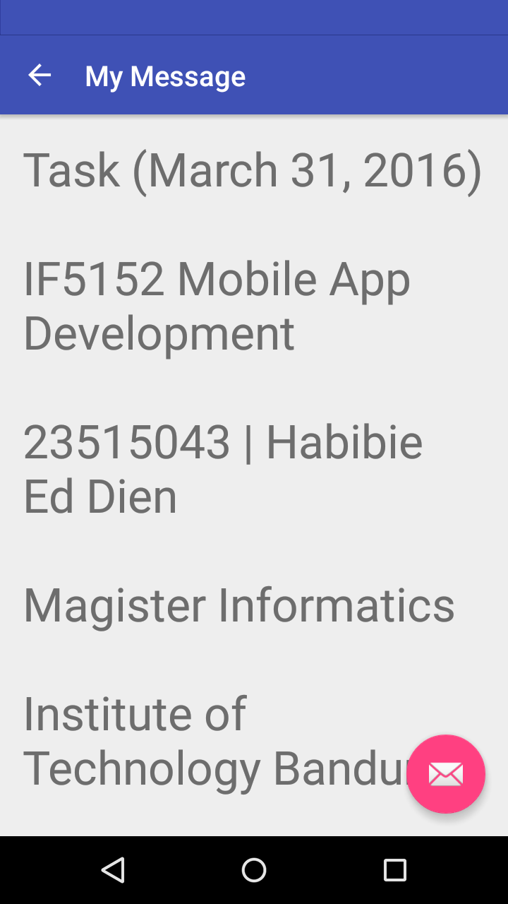

# MyFirstApp
Based on training : http://developer.android.com/training/basics/firstapp/index.html

It has 2 activity (MyActivity and DisplayMessageActivity) with getIntent() - String feature.

Added : Clear Button

#Screenshot

Task (March 31, 2016) - IF5152 Mobile App Development

23515043 | Habibie Ed Dien

Magister Informatics

Intitute of Technology Bandung
